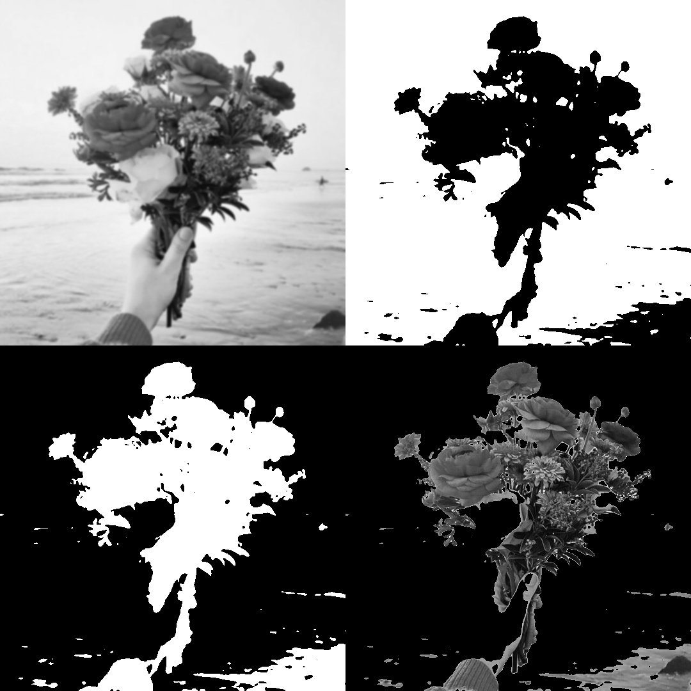
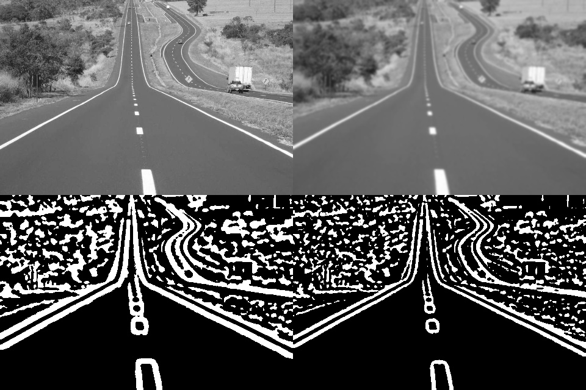

# Estudos Visão Computacional com Python
[](https://twitter.com/marcelxsilva)

> # Binarização com limiar

Em muitos casos existe a necessiidade de realizar modificações em imagens como redimensionar, cortar ou rotacionar, esse processo pode ser feito de varias formas.

Esta parte será bem rapida, apenas sera demonstrado o processo de Binarização com limiar.

Iremos converter a imagem em tons de cinza para imagens preto e branco onde todos os pixels possuem 0 ou 255 como intensidade.

```Python
import numpy as np
import cv2
img = cv2.imread('imagem.jpg')
img = cv2.cvtColor(img, cv2.COLOR_BGR2GRAY)

suave = cv2.GaussianBlur(img, (7, 7), 0) # aplica blur
(T, bin) = cv2.threshold(suave, 160, 255, cv2.THRESH_BINARY)
(T, binI) = cv2.threshold(suave, 160, 255, cv2.THRESH_BINARY_INV)

resultado = np.vstack([np.hstack([suave, bin]),
np.hstack([binI, cv2.bitwise_and(img, img, mask = binI)])
])
cv2.imshow(".", resultado)
cv2.waitKey(0)
```


Realizamos a suavização da imagem, o processo de binarização e a inversão da imagem binarizada, esta técnica é utilizada por carros autonomos para identificara a pista e utilizada para detecção de objetos.

Uma outra forma de atingir um resultado semelhante porem com um exemplo diferente, como dito antes a suavização da imagem facilita na identificação de bordas, vamos ver um exemplo.
```Python
import numpy as np
import cv2
img = cv2.imread('estrada.jpg')
img = img[::2,::2]
img = cv2.cvtColor(img, cv2.COLOR_BGR2GRAY) # converte

suave = cv2.GaussianBlur(img, (7, 7), 0) # aplica blur

bin1 = cv2.adaptiveThreshold(suave, 255,cv2.ADAPTIVE_THRESH_MEAN_C, cv2.THRESH_BINARY_INV, 21, 5)

bin2 = cv2.adaptiveThreshold(suave, 255, cv2.ADAPTIVE_THRESH_GAUSSIAN_C, cv2.THRESH_BINARY_INV,21, 5)

resultado = np.vstack([ np.hstack([img, suave]), np.hstack([bin1, bin2])])

cv2.imshow(" imagem", resultado)
cv2.waitKey(0)
```

Note que o resultado da imagem suavizada touxe linhas mais definidas




***
[Voltar ao Inicio](../README.md)

 Author **Marcelo Silva**

* Twitter: [@marcelxsilva](https://twitter.com/marcelxsilva)
