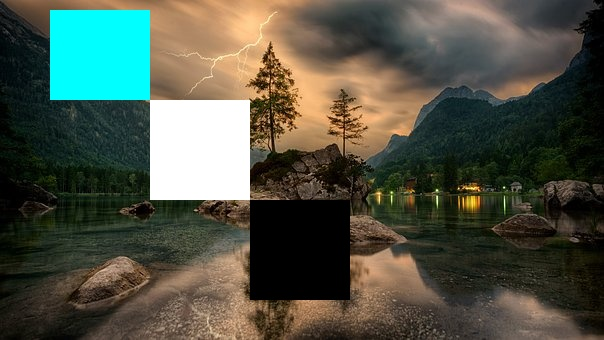
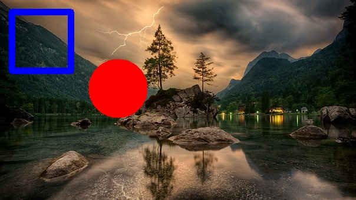

# Estudos Visão Computacional com Python
[](https://twitter.com/marcelxsilva)

> Primeiros Passos

Vimos em [Sistemas de Coordenadas](../SISTEMAS_DE_COORDERNADAS/SISTEMAS_DE_COORDERNADAS.md) que é possivel modificar um unico pixel em uma imagem, quero mostrar alguns exemplo para explorar melhor a técnica de slicing.

Imagem Original


Código
```Python
import cv2
image = cv2.imread('imagem.jpg')

image[10:100, 50:150] = (255, 255, 0)
#Cria um quadrado branco
image[100:200, 150:250] = (255, 255, 255)
#Cria um quadrado preto
image[200:300, 250: 350] = (0, 0, 0)

cv2.imshow("Imagem alterada", image)

```
Resultado



Com esta técnica podemos formar quadrados e retangulos, mas se caso quisermos criar outro tipo de objeto precisamos utilizar os métodos do openCV

```Python
import cv2
import numpy as np 

image = cv2.imread('1.jpg')

vermelho = (0,0,255)
verde = (0, 255, 0)
azul = (255,0,0)

cv2.rectangle(image, (20, 20), (120, 120), azul, 10)
cv2.circle(image, (100, 150), 50, vermelho, 5)

cv2.imshow("Desenhando sobre a image", image)
cv2.waitKey(0)
```

Resultado



Vamos entender o código, o <code>cv2.rectangle</code> possui os seguintes paramentros
    
    cv2.rectangle (imagem, ponto inicial, ponto final, cor, espessura)

Sobre os pontos iniciais e finais, acredito que nao vai ser necessario explicar, pois ja vimos.


***
[Voltar ao Inicio](../README.md)

 Author **Marcelo Silva**

* Twitter: [@marcelxsilva](https://twitter.com/marcelxsilva)
