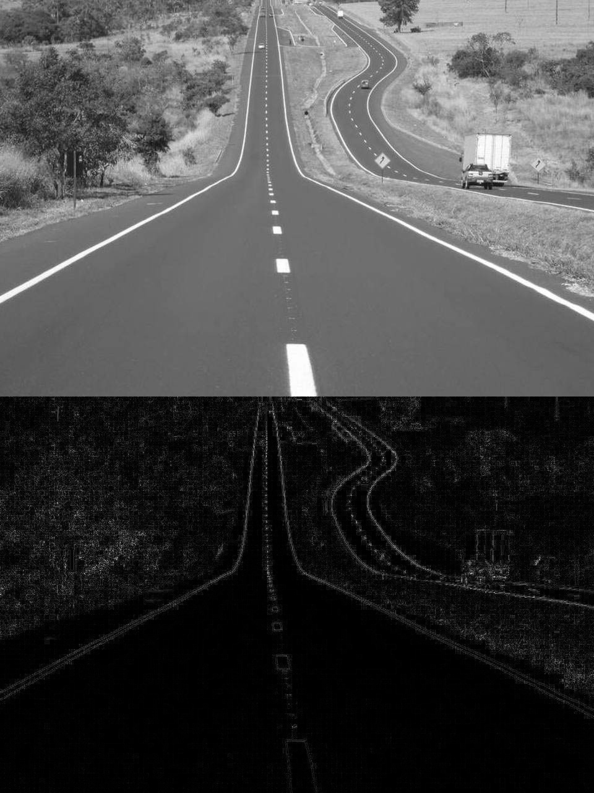
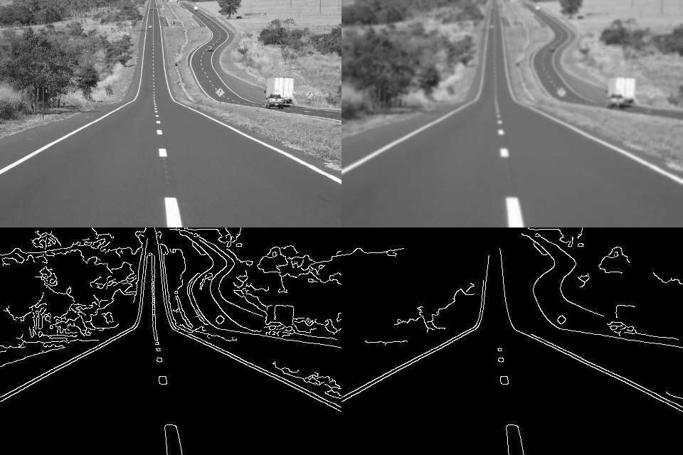

# Estudos Visão Computacional com Python
[](https://twitter.com/marcelxsilva)

> # Detecção de Bordas

Umas das tarefas mais importantes para a visão computacional é a detecção de objetos, para se atingir esse objetivo é utilizado diversas técnicas na detecção de bordas afim de identificar objetos, já aplicamos alguns conceitos desse nos passos anteriores.

Existem alguns algoritmos que podemos utilizar para a detecção de bordas no OpenCV e a formula que esses algoritmos utilizam para a detectção de bordas é converter a imagem para preto e branco e a identificação dos gradientes na imagem, como a alteração brusca na intensidade dos pixels em uma região.

### Filtro Laplaciano
Vamos ver um exemplo utilizando o algoritmo Laplaciano do OpenCV

```Python
import numpy as np
import cv2
img = cv2.imread('estrada.jpg')
img = cv2.cvtColor(img, cv2.COLOR_BGR2GRAY)
suave = cv2.GaussianBlur(img, (7, 7), 0)
canny1 = cv2.Canny(suave, 20, 120)
canny2 = cv2.Canny(suave, 70, 200)
resultado = np.vstack([np.hstack([img,suave ]), np.hstack([canny1, canny2]) ])
cv2.imshow("Detector de Bordas Canny", resultado)
cv2.waitKey(0)

```



### Detector de bordas
Aqui vamos utilizar o Canny, faz os seguintes passos para detectar bordas:

- Aplicar um filtro gaussiano para suavizar a imagem e remover o ruído.
- Encontrar os gradientes de intensidade da imagem.
- Aplicar Sobel(outro algoritmo do OpenCV) duplo para determinar bordas potenciais.
- Aplicar o processo de “hysteresis” para verificar se o pixel faz parte de uma
borda “forte” suprimindo todas as outras bordas que são fracas e não
conectadas a bordas fortes.

Forneceremos dois argumentos alem da imagem para o Canny, chamados de limiar 1 e limiar 2, eles funcionaram como um tipo de filtro e ira considerar apenas o valor que tiver dentro desse filtro.

```Python
import numpy as np
import cv2
img = cv2.imread('estrada.jpg')
img = img[::2,::2]
img = cv2.cvtColor(img, cv2.COLOR_BGR2GRAY)
suave = cv2.GaussianBlur(img, (7, 7), 0)
canny1 = cv2.Canny(suave, 20, 120)
canny2 = cv2.Canny(suave, 70, 200)
resultado = np.vstack([np.hstack([img,suave ]), np.hstack([canny1, canny2]) ])
cv2.imshow("Detector de Bordas Canny", resultado)
cv2.waitKey(0)

```



***
[Voltar ao Inicio](../README.md)

 Author **Marcelo Silva**

* Twitter: [@marcelxsilva](https://twitter.com/marcelxsilva)
