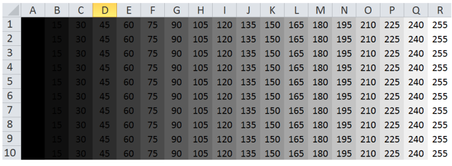
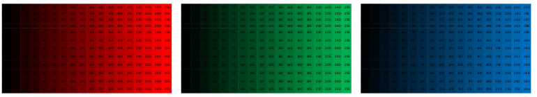
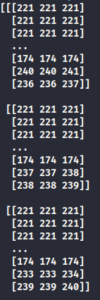
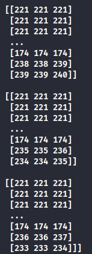

# Estudos Visão Computacional com Python
[](https://twitter.com/marcelxsilva)

> Primeiros Passos

Após  a instalação do openCV vamos testar se esta tudo instalado corretamente, crie um arquivo e coloque este código:

```Python
# importando opencv
import cv2
# leitura de uma imagem que esta no mesmo diretorio do script
imagem = cv2.imread('entrada.jpg')

print('Largura em pixels: ', end='')
print(imagem.shape[1]) #largura da imagem
print('Altura em pixels: ', end='')
print(imagem.shape[0]) #altura da imagem
print('Qtde de canais: ', end='')
print(imagem.shape[2])
# Mostra a imagem com a função imshow
cv2.imshow("Nome da janela", imagem)
cv2.waitKey(0) #espera pressionar qualquer tecla
# Salvar a imagem no disco com função imwrite()
cv2.imwrite("saida.jpg", imagem)
```
Este script basicamente carrega nossa imagem, mostra as suas propriedades e ao pressionar "0" ele faz uma cópia da imagem e salva com o nome <code>saida.jpg</code>.

Vamos entender nosso código
```Python
    # importando opencv
    import cv2
    # leitura de uma imagem que esta no mesmo diretorio do script
    imagem = cv2.imread('entrada.jpg')
```
<code>import cv2</code> esta importando o openCV que é obrigatório essa importação se quiser utilizar os seus métodos, como por exemplo carregar a imagem pelo método <code>imread()</code>.

A imagem é lida e armazenada na variável "imagem", esta variável dara acesso ao objeto da imagem que basicamente é uma matriz de 3 dimensões, em cada uma dessas dimensões estão uma das três cores do padrão RGB,(red,green,blue), quando for uma imagem preto e branco teremos apenas 1 matriz de duas dimensões.

Para facilitar o entendimento vamos imaginar uma planilha, que possui linhas e colunas sendo uma matriz de duas dimensões, cada célula dessa matriz é um pixel, que no caso da imagem ser preto e branco terão um valor variado entre 0 á 255, sendo 0 preto e 255 branco.



Então como dito, imagens preto e branco é composta de uma matriz com duas dimensões como na imagem acima.

Para imagens coloridas temos três dessas matrizes de duas dimensões cada uma representando uma das cores RGB, sendo cada pixel formado por 3 inteiros de 8 bits, (0,0,0) formando o padrão RGB, segue alguns exemplos:

- Vermelho - RGB (255,0,0);
- Verde - RGB (0,255,0);
- Amarelo - RGB (255,255,0);
- Magenta - RGB (255,0,255);

Como a junção de 3 matrizez podemos formar muitas cores em diferentes tonalidades. [Já fiz alguns experimentos desse conceito com Arduno](https://github.com/marcelxsilva/arduino/blob/master/LED_RGB/LED_RGB.md), então a junção das 3 matrizes produz a imagem colorida com a capacidade de reproduzir 16,7 Milhões de cores.



No exemplo, se voce executar o script novamente porem dessa forma:
```Python
    import cv2
    imagem = cv2.imread('entrada.jpg')
    print(imagem)
```

Na imagem abaixo esta um exemplo das duas matrizes e suas dimensões em uma de uma imagem preto e branco:





***
[Voltar ao Inicio](../README.md)

 Author **Marcelo Silva**

* Twitter: [@marcelxsilva](https://twitter.com/marcelxsilva)
