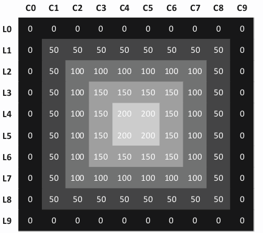

# Estudos Visão Computacional com Python
[](https://twitter.com/marcelxsilva)

> Sistema de Coordenadas

Ja sabemos que temos uma representação de 3 cores do sistema RGB para cada pixel da imagem, podemos alterar a cor de cada pixel individualmente.

Para isso, precisamos entender o sistema de coordenadas, (linha, coluna) onde o pixel do lado superior esquedo esta na posição (0,0) esta na linha zero e coluna zero.



A partir do momento que entendemos o sistema de cordenadas conseguimos modificar ou ler cada pixel da imagem.

O código abaixo nos permite ler os valores do pixel na posição (0,0)
```Python
    (b, g, r) = imagem[0, 0]
    print(b, g, r)
```
Então, tendo os valores dos pixel podemos exibi-los em tela com o <code>print</code>, as imagens são compostas por matrizes numpy neste caso retornadas pelo método imread e dessa forma podemos modifica-las, note que a ordem é b, g, r pois o vetor nos retorna os valores invertidos, guarde isso pois será importante futuramente.

Como exemplo, podemos mudar as cores de alguns pixel
```Python
import cv2
imagem = cv2.imread('imagem.jpg')

for y in range(0, imagem.shape[0], 10): 
    for x in range(0, imagem.shape[1], 10): 
        imagem[y:y+5, x: x+5] = (255,255,255)
cv2.imshow("Imagem modificada", imagem)
cv2.waitKey(0)
   
```

Resultando em:


Se quisermos alterar o valor do pixel em determinada posição, basta indicarmos a posição e o valor, como no exemplo acima.
```Python
imagem[10, 0] = (255,255,255)
```

Podemos compreender que neste exemplo o valor 10, representa a linha e o valor 0 representa a coluna, se colocarmos <code>imagem[: , 50:100] = (255,255,255)</code> a coluna sera preencida do topo a base da imagem e a largura será do pixel 50 ao 100, resultando em:


***
[Voltar ao Inicio](../README.md)

 Author **Marcelo Silva**

* Twitter: [@marcelxsilva](https://twitter.com/marcelxsilva)
