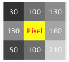
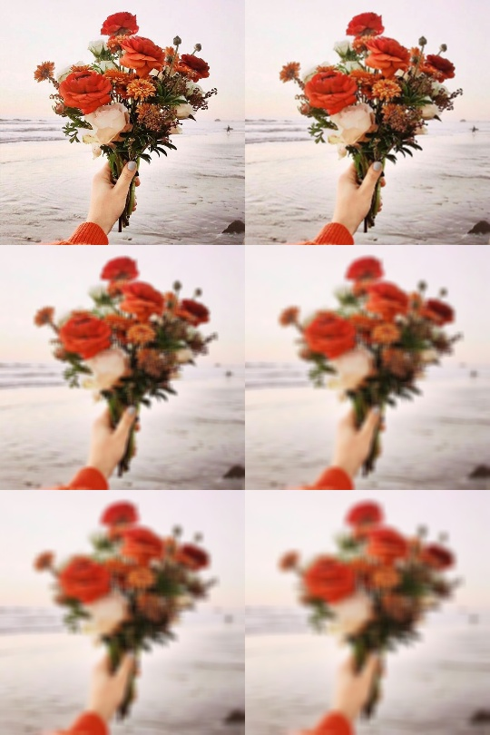

# Estudos Visão Computacional com Python
[](https://twitter.com/marcelxsilva)

> # Suavização de imagens
A suavização da imagem  é um "borrão" na imagem, como visto em algumas imagens desfocadas, está técnica é muito eficaz para identificar alguns objetos ou locais como por exemplo a detecção de bordas.


### Suavização por calculo de média

A suavização de cada pixel é calculada na soma da média dos pixels que estão em volta do pixel em questão, imagine uma "caixa de pixels" que contem 9 valores, o valor do pixel no centro dessa baixa será baseado na média dos pixels vizinhos, esta caixa é chamada de janela de calculo.



Código

```Python
import numpy as np
import cv2
img = cv2.imread('imagem.jpg')
img = img[::2,::2] # Diminui a imagem
suave = np.vstack([
np.hstack([img,
cv2.blur(img, ( 3, 3))]),
np.hstack([cv2.blur(img, (5,5)), cv2.blur(img, ( 7, 7))]),
np.hstack([cv2.blur(img, (9,9)), cv2.blur(img, (11, 11))]),
])
cv2.imshow("Resultado", suave)
cv2.waitKey(0)
```
O resultado será este



Perceba que o método <code>blur</code> é o responsavel por realizar o calculo da média já os parametros são a imagem a ser suavizada e a janela de suavização, utilizei os métodos hstack(horizontal) e vstack(vertical) para juntar as imagens em uma só.

### Suavização Gaussiana
Diferente do método aplicado antes essa é um pouco mais simples, usamos a função <code>cv2.GaussianBlur()</code> e passamos para ela como argumento a imagem a ser suavizada, os mesmos numeros passado antes para calcular a média e a quantidade de desvios do eixo Y e Y que passarei como 0.

```Python
import numpy as np
import cv2
img = cv2.imread('imagem.jpg')
img = img[::2,::2] # Diminui a imagem
suave = np.vstack([
np.hstack([ cv2.GaussianBlur(img, ( 3, 3), 0)]),
np.hstack([ cv2.GaussianBlur(img, ( 5, 5), 0)]),
np.hstack([ cv2.GaussianBlur(img, ( 7, 7), 0)]),
np.hstack([ cv2.GaussianBlur(img, ( 9, 9), 0)])
])

cv2.imshow("Resultado", suave)
cv2.waitKey(0)
```

Existem diversas formas para se atingir esse resultado com o OpenCV, mas as que vimos até agora é o suficiente para o que iremos fazer mais a frente.
***
[Voltar ao Inicio](../README.md)

 Author **Marcelo Silva**

* Twitter: [@marcelxsilva](https://twitter.com/marcelxsilva)
