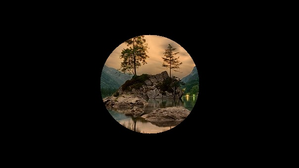

# Estudos Visão Computacional com Python
[](https://twitter.com/marcelxsilva)

> # Transformações e máscaras

Em muitos casos existe a necessiidade de realizar modificações em imagens como redimensionar, cortar ou rotacionar, esse processo pode ser feito de varias formas.

### Cortando uma imagem

Primeiro vamos ver uma técnica que se chama crop, ao qual possui a finalidade de cortar uma imagem,o código abaixo mostra como isso é feito.

```Python
import cv2
imagem = cv2.imread("imagem.jpg")
recorte = imagem[100:400,  200:400]
cv2.imshow('Resultado', recorte)
cv2.waitKey(0)
```

Estamos carregando a imagem, definindo que queremos pegar apartir da linha 100 á 400 e coluna 200 á 400. o que nos retorna este resultado:


Se voce acompanhou os passos anteriores sabe como é essa imagem original.

### Redimensionando Imagem
Uma das técnicas bem interessante é a de ‘slicing’, faciliando muito o redimensionamento da imagem.

```Python
import numpy as np
import cv2
img = cv2.imread('imagem.jpg')
cv2.imshow("Original", img)
resultado = img[::2,::2]
cv2.imshow("Imagem redimensionada", resultado)
cv2.waitKey(0)
```
O código basicamente refaz a imagem, pegando a primeira linha, ignora a segunda em seguida pega a terceira e ignora a quarta, e assim por diante. O mesmo é feito com as colunas, gerando o mesmo resultado.

### Espelhamento 
Como já aprendemos as imagens são compostas por matrizes, e para inverter uma imagem basta apenas inverter seus valores, colocando os primeiros no final e assim por diante e podemos fazer isso de duas formas ou utilizando funções do cv2 ou manualmente com recursos da própria linguam, vamos aprender os dois modos.

```Python
import cv2
img = cv2.imread('imagem.jpg')

cv2.imshow('',img)

# Recursos da linguagem
horizontal = img[::-1,:]
vertical = img[:,::-1]

# funcoes
horizontal = cv2.flip(img,1)
vertical = cv2.flip(img, -1)

cv2.imshow('',horizontal)
cv2.waitKey(0)
```
### Máscaras 
Vamos falar sobre mascaras que nada mais é que uma imagem onde cada pixel pode estar "ligado" ou "desligado", possuindo pixels preto e branco, vamos formar um circulo.

```Python
import cv2
import cv2
import numpy as np

img = cv2.imread('imagem.jpg')
mask = np.zeros(img.shape[:2],dtype="uint8")

(cX, cY) = (img.shape[1] // 2, img.shape[0] // 2)

cv2.circle(mask, (cX, cY), 100, 255, -1)

img_com_mascara = cv2.bitwise_and(img, img, mask = mask)
cv2.imshow("Mask", img_com_mascara)

cv2.waitKey(0)
```
Resultado



***
[Voltar ao Inicio](../README.md)

 Author **Marcelo Silva**

* Twitter: [@marcelxsilva](https://twitter.com/marcelxsilva)
